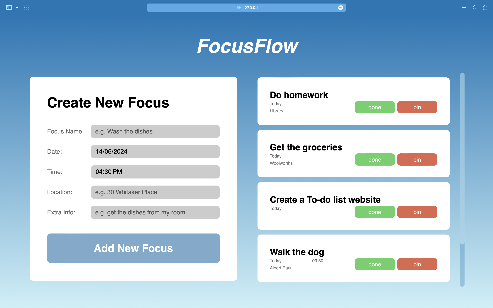

# FocusFlow

**FocusFlow** is a To-do list app designed to help users organize their tasks and stay focused. It utilizes HTML, CSS, and JavaScript to create a dynamic and interactive user interface.

The app features a loading screen with a subtle animation to engage users while the app loads. Users can create new tasks by entering a title, date, time, location, and extra information. Tasks are displayed in a list format, with each task containing options to mark it as done or delete it.

**Local storage** is used to save tasks, ensuring that tasks persist even after the user closes the app. This way, users can keep track of their tasks and manage them efficiently.

## Languages Used

- **HTML** structures the content of the app, defining elements such as the header, input fields, and buttons.
- **CSS** styles the app, including colors, fonts, layout, and animations, to make it visually appealing and user-friendly.
- **JavaScript** adds functionality, such as creating new tasks, deleting tasks, and handling user interactions.

Overall, **FocusFlow** is a simple yet effective To-do list app that demonstrates the use of HTML, CSS, and JavaScript to create a responsive and interactive web application.
